# Learnings

- About react and how it work in respect to DOM.
- Statefull stateless and pure function components.
- How to pass data to child using props, and how to lift state up to pass data between components.
- using useState hooks

  - How to use it with simple state
  - How to use it with arrays
  - How to use it with simple objects
  - How to use it with nested objects.

- Working with forms

  - How forms are created in react.
  - useRef hooks for retriving form data.
  - How to use react-hook-form for creating more managable forms.
  - How to use ZOD to validate complex forms , with custom error message for each form.

- Working with API's

  - how to use sideEffect hooks.
  - how to create custom hook.
  - how to use axinos library for making api request (which is so good.)
  - how to create generic api request making class.

  ==========================================================================

To start test server type : npm run dev

`Create upload file feature` : https://dashboard.edgestore.dev/

Q1. What is react ?

- it's javascript library to build the fron-end with the flexibilty of reusable components with help of jsx (JavaScript XML)

Q2. How react works?

- With the compoent given react build the virtul DOM ( which is in-memory representation of actual DOM) , so if some DOM element changes react compares first compares it with last version of it's and if that different then updates it.(This is done by library React-DOM)

# Fragment

in react we can't return two elements , either they have to wrap inside the another div element , but that is like creating another element just to make react happy , solution: fragment , with won't insert any other extra element in dom.

```
eg.
return (
	<>
		<h1> Hello World</h1>
		<p> This is paragraph tag </p>

	</>
)
```

`note` : in the list each list-item must have unique key , that way react keeps tracks of something got change in list which part need to be updated.Make sure that key is unique in the entire list.Actually key can be given to any element.

### Conditional Rendering

`{cities.length === 0 && <p>No cities found in database</p>}`

#### useState

- this is called hook in react , which help to create statefull componenets , So we can update compoenet on change of value.And when value changes react will re-renders the component and all it's children.

### Props

- These are the ways we can pass data to component and there is only one directional pass from parent to child component.They are immutable, one thing common with state variables(like we create with useState ) that when they change component re-renders.
- 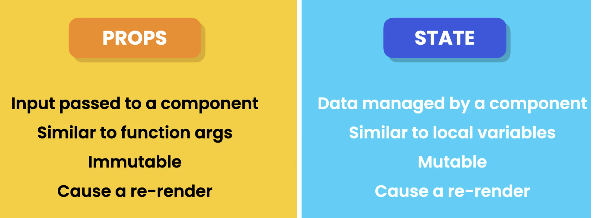

### Children Prop

- We have created structure where div container have many children , what if instread of div when want to create our custom component and able to define children like we do for div and children passes to our component so we can render them.it has special prop name `children` : ReactNode . **See example of alert component.**

`note` : install React Developer Tool extension for chrome to inspect our component.

#### Popular UI libraries

- Bootstrap
- Material UI
- Tailwind CSS
- Daisy UI
- Chackra UI
- Next-UI

`For Icons` : npm i react-icons@4.7.1

# State Management in React

- React manages the state( we use from usestate) asynchronously.Because there might be multiple state change statement which can lead to frequest updates , due to that reason , so that react can batch them and run together it does that.
- State is stored outside of the component. `Reason` as we know that when function finished it's all memory get freed , and same with react component if you see it's also a function.For that reason react stores state outside the component.
- We can't use state hooks inside the for loop , if statements , we can only use that at the top level.(why? research)
- Go for object if multiple state have related data , `beware` never go for deeply nested structure.
- Also avoid redundant state variables.

#### Function Purity

- This concept states that given same input our function should always return same output , which is called pure function,in terms of react given same props our component should always return/render same jsx. That's why any changes which does not related to UI have to keep outside the render phase , so that react can skip re-rendering on those which in result performance.
- Below is example of impure funciton :
  - 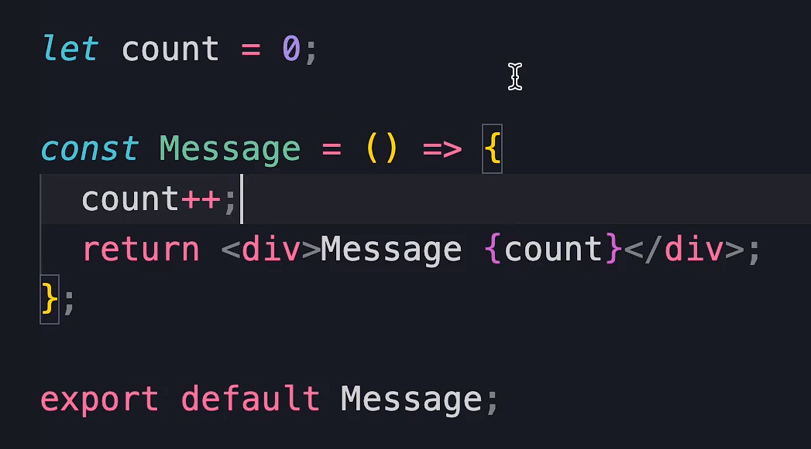result : 
    - we are seeing 2,4,6 , not 1,2,3 because in dev mode react uses strictmode , so for each component first render is to see any issue , and then react uses second render for display.Which help us to find the impure component like in above example.
- In this as many time componet will render this count will update , which in result different jsx every time.
- If want to use that use like below so that our function can be pure.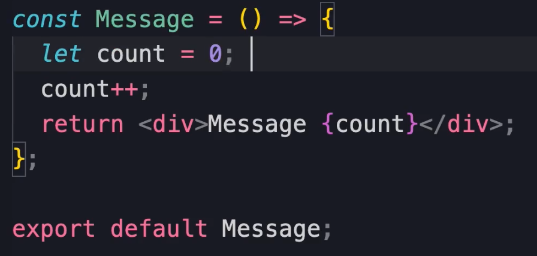
  result : 

`note`: just like props state object must be treated as immutable and when updating any field in object so that we can emmit the update on UI , we have to pass whole new object to state function , just assigning new value to the any field of object directly won't work.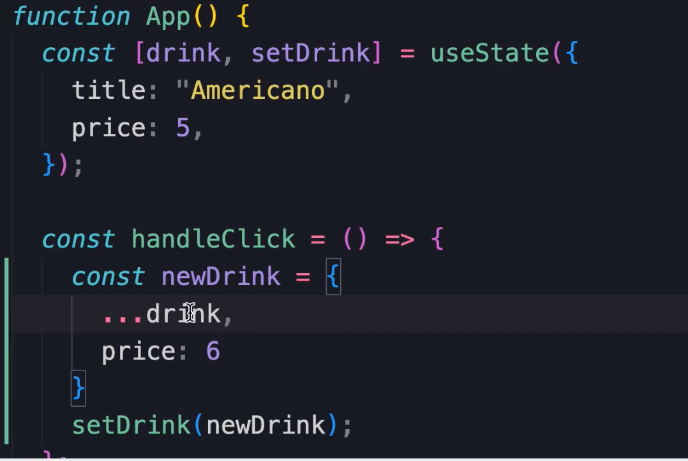

so as you can see above , we copied every property of drink object to newDrink and just updated the price from last and passed the newDrink to setDrink.

#### Updating Deeply nested objects

- Why is this concern? : Because spread operator is shallow , it will copy what is in-memory.And we talked about ealier , when we update state we have to create entirely different object. Let see below how we updated the zip-code of the customer.
- Define the initial customer state : 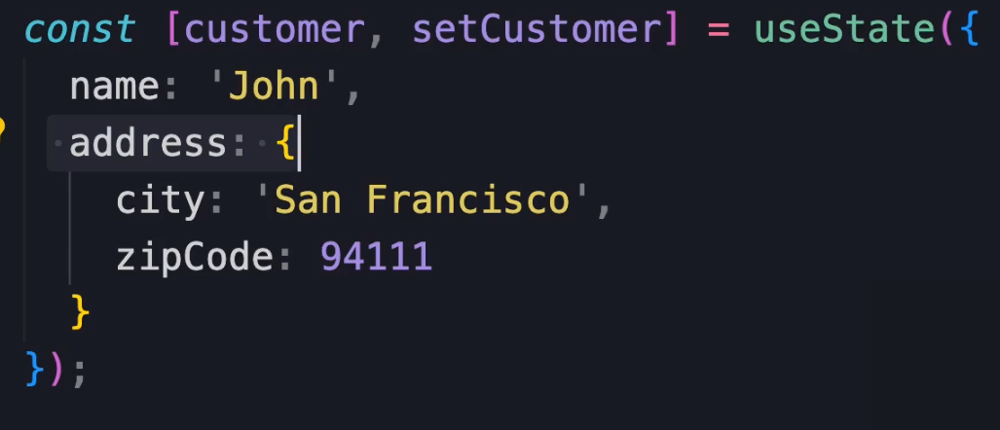
- This is how update should be done : 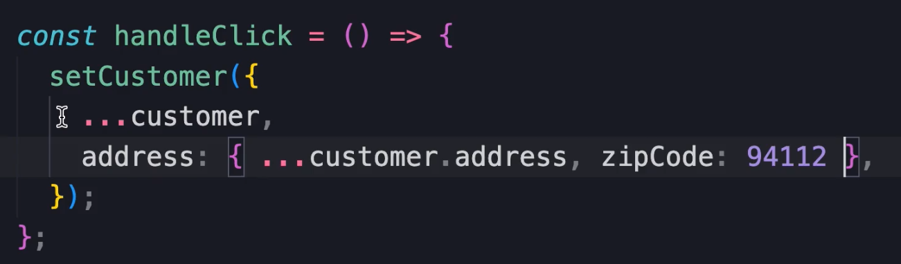
- so avoid very deep nested structure , because as deep structure get's more complicated our update logic will be.

#### Updating Array

- we have to assign new array . se below how that can be achieved.
- 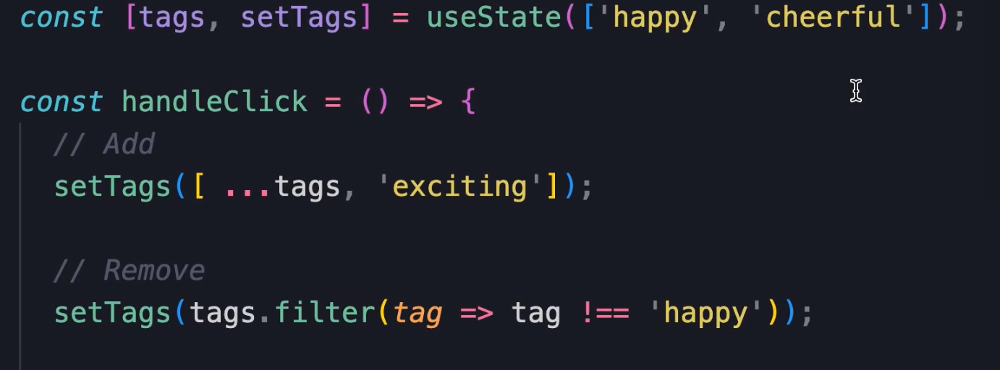

  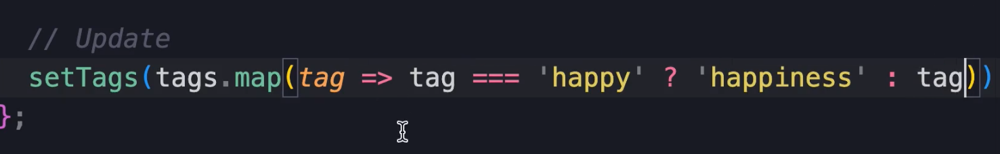

#### Updating array of objects

- 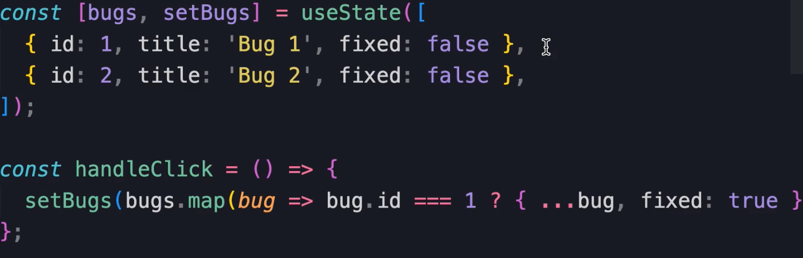

#### Simplifying Our Update Logic

- npm i immer@9.0.19
- import immer
- Let's modify above setBugs function : 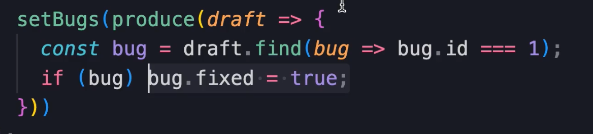

#### Sharing State between Component

- To share the state between component(let say shopping cart and product_selected_count) , for that we have to lift the state up to the near parent of them and put the usestate logic there and pass data as props.
- Always remember to treat props as immutable objects and the component who holds the state only that should be allowed to change it.So if you want to change the state from child pass the callback from parent to child, don't let child allow to change the state directly.

# Working with form

- useRef : this is another react hook which will help us to refer the DOM element , in form we'll need this to get information from input fields
- There is other way to do the thing using the useState hook.
- When we update our value only on the case of event then input filed property called value and data we are storing might go unsync , so to make it sync always assing value property with the state variable.
- npm i react-hook-form@7.43 : this will help us to build form with less codes. One big advantage I found using it was that it does not re-renders the element as we update the form-field unlike it was doing in case or useState one.
- We can also use above library to do form validation as well in that.
- ```
  import { FieldValues, useForm } from "react-hook-form";
  interface FormData {
    name: String;
    age: Number;
  }

  const Form = () => {
    const {
      register,
      handleSubmit,
      formState: { errors },
    } = useForm<FormData>();

    const onSubmit = (data: FieldValues) => console.log(data);

    return (
      <form onSubmit={handleSubmit(onSubmit)}>
        <div className="mb-3">
          <label htmlFor="name" className="form-label">
            Name
          </label>
          <input
            id="name"
            {...register("name", { required: true, minLength: 3 })}
            type="text"
            className="form-control"
          />
          {errors.name?.type === "required" && (
            <p className="text-danger"> The name is requied </p>
          )}
          {errors.name?.type === "minLength" && (
            <p className="text-danger"> The name must be 3 characters long</p>
          )}
        </div>

        <div className="mb-3">
          <label htmlFor="age" className="form-label">
            Age
          </label>
          <input
            id="age"
            {...register("age")}
            type="number"
            className="form-control"
          />
        </div>
        <button className="btn btn-primary" type="submit">
          Submit
        </button>
      </form>
    );
  };

  export default Form;

  ```

#### Schema Based Validation with ZOD

- npm i zod@3.20.6
- To integrate ZOD with hookform : npm i @hookform/resolvers@2.9.11

```
import { FieldValues, useForm } from "react-hook-form";
import { z } from "zod";
import { zodResolver } from "@hookform/resolvers/zod";

// define the schema for validating our input fields
const schema = z.object({
  name: z.string().min(3, { message: "Name must be atleast 3 character long" }),
  age: z
    .number({ invalid_type_error: "Age field is required" })
    .min(18, { message: "Age must be at least 18." }),
});

type FormData = z.infer<typeof schema>; // zod will create type for us based on the schema we defined above.

const Form = () => {
  const {
    register,
    handleSubmit,
    formState: { errors },
  } = useForm<FormData>({ resolver: zodResolver(schema) });

  const onSubmit = (data: FieldValues) => console.log(data);

  return (
    <form onSubmit={handleSubmit(onSubmit)}>
      <div className="mb-3">
        <label htmlFor="name" className="form-label">
          Name
        </label>
        <input
          id="name"
          {...register("name")}
          type="text"
          className="form-control"
        />
        {errors.name && <p className="text-danger"> {errors.name.message}</p>}
      </div>

      <div className="mb-3">
        <label htmlFor="age" className="form-label">
          Age
        </label>
        <input
          id="age"
          {...register("age", { valueAsNumber: true })}
          type="number"
          className="form-control"
        />
        {errors.age && <p className="text-danger"> {errors.age.message}</p>}
      </div>
      <button className="btn btn-primary" type="submit">
        Submit
      </button>
    </form>
  );
};

export default Form;

```

`conclusion`: on working with react forms use zod for validation and react-hook-form for managing form state and @hookform/resolvers/zod to integrate the zod validation with react-hook-form.

# Connecting to Backend

- Remember our function (which is component) must be pure , so how we'll hand the side-effects .

  - Side-effects like : = store data in local storage
  - Call the server to fetch/save data
  - Manually modify the DOM
  - if you see none of the situation is about the rendering the component they none of them are returning the jsx markup.
  - That's where useEffect hook comes in picture , to execute a piece of code after a component is rendered.
  - Like other hooks eg.useState and other , this useEffect hook can only be called on top-level of our componenet , not inside the for loop or if statement.
  - Second arguemnt in useEffect will decide how it will run , if not provided then at every compoent render , if provided empty arry then only at the first time when component is created, if provided mutiple variable in array then on any of those variable change it will run.
  - Never -ever run update your useState variable in useEffect with no second argument provided otherwise it will go in infinite loop.
  - If you want to run any clenup code , which should be run when the componenet is unmounted then put that code in the return like in below example.

    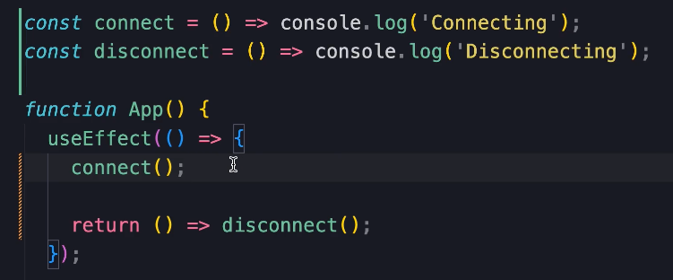

  - npm i axios@1.3.4 : we'll use this library to fetch data from server instead of fetch api.
  - When working with api there are two types of updates we can do , 1. Optimistic update (update the UI , then send request to backend for update , if err then revert back to original UI state)
    2.Passimistic Update (first backend , then UI)
  - It is adviced to use Optimistic Update.
  - In the end we worked on creating generic HTTP request class, and custom Hooks.
